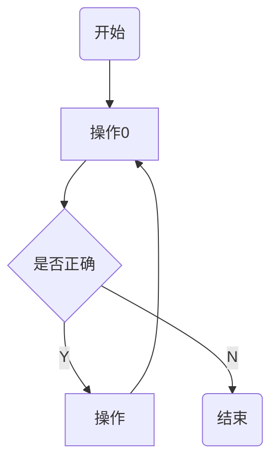

# 标题

标题有两种格式：

一级标题
===================================
二级标题
---
# 一级标题
## 二级标题
### 三级标题
#### 四级标题

：标题笔记完毕

#  段落

## 段落换行

这是一个标准段落，没啥写的只好乱写。主要是测试一下段落的换行功能，看源码的段落末尾就行。这是一个标准段落，没啥写的只好乱写。主要是测试一下段落的换行功能，看源码的段落末尾就行。这是一个标准段落，没啥写的只好乱写。主要是测试一下段落的换行功能，看源码的段落末尾就行。直接回车。

这是一个标准段落，没啥写的只好乱写。主要是测试一下段落的换行功能，看源码的段落末尾就行。这是一个标准段落，没啥写的只好乱写。主要是测试一下段落的换行功能，看源码的段落末尾就行。这是一个标准段落，没啥写的只好乱写。主要是测试一下段落的换行功能，看源码的段落末尾就行。单空格+回车。 

这是一个标准段落，没啥写的只好乱写。主要是测试一下段落的换行功能，看源码的段落末尾就行。这是一个标准段落，没啥写的只好乱写。主要是测试一下段落的换行功能，看源码的段落末尾就行。这是一个标准段落，没啥写的只好乱写。主要是测试一下段落的换行功能，看源码的段落末尾就行。双空格+回车。  

## 字体

*斜体*

_斜体_

**粗体**

__粗体__

***又粗又斜***

___又粗又斜___

## 分割线

***

***********************
* * * *

----------

-- -- --

## 删除线

~~删除~~

## 下划线

<u>下划线</u>

## 脚注

可能的正文[^这是脚注]

[^这是脚注]:阿达


# 列表

有序和无序，支持嵌套

1. 有序
   + 无序
   + 无序
2. 有序
   - 无序
3. 发射
   * 无序

# 区块

> 区块
>
> 区块
>
> > 嵌套区块

# 代码

段落代码`printf`

注意是波浪线按键

代码区块

	int main(){
	xx();
	}


```c
	void xx(){}
```

```java
public class main{
	pubilc static void main(String[] args){
	  xx();
	}
}
```

# 链接

[链接名称](链接地址)

<ftp://192.168.137.185:2121>

链接脚注形式[google][1]

[1]: ftp://192.168.137.185:2121

# 图片


图片链接[图片介绍][tu]

[tu]:  http://static.runoob.com/images/runoob-logo.png


| 表头 | 一项 | 二项 |
| :-: | :--- | ---: |
| 表1  | :微笑: |  |
| 表2  | |  |

# 表情

:rose:
&#x1F34e;

:smile:详情<https://unicode.org/Public/emoji/13.0/emoji-sequences.txt>

[🎁 Emoji cheat sheet for GitHub, Basecamp, Slack & more (webfx.com)](https://www.webfx.com/tools/emoji-cheat-sheet/)

[在 Markdown 中使用表情符号 - 知乎 (zhihu.com)](https://zhuanlan.zhihu.com/p/147764147)

# 公式

行内公式 $y=sin(x+y)$


# 附录

## Typora快捷键

一：菜单栏
文件：alt+F
编辑：alt+E
段落：alt+P
格式：alt+O
视图：alt+V
主题：alt+T
帮助：alt+H
二：文件
新建：Ctrl+N
新建窗口：Ctrl+Shift+N
打开：Ctrl+O
快速打开：Ctrl+P
保存：Ctrl+S
另存为：Ctrl+Shift+S
偏好：Ctrl+,
关闭：Ctrl+W
三：编辑
撤销：Ctrl+Z
重做：Ctrl+Y
剪切：Ctrl+X
复制：Ctrl+C
粘贴：Ctrl+V
复制为MarkDown：Ctrl+Shift+C
粘贴为纯文本：Ctrl+Shift+V
全选：Ctrl+A
选中当前行/句：Ctrl+L
选中当前格式文本：Ctrl+E
选中当前词：Ctrl+D
跳转到文首：Ctrl+Home
跳转到所选内容：Ctrl+J
跳转到文末：Ctrl+End
查找：Ctrl+F
查找下一个：F3
查找上一个：Shift+F3
替换：Ctrl+H
四：段落
标题：Ctrl+1/2/3/4/5
段落：Ctrl+0
增大标题级别：Ctrl+=
减少标题级别：Ctrl±
表格：Ctrl+T
代码块：Ctrl+Shift+K
公式块：Ctrl+Shift+M
引用：Ctrl+Shift+Q
有序列表：Ctrl+Shift+[
无序列表：Ctrl+Shift+]
增加缩进：Ctrl+]
减少缩进：Ctrl+[
五：格式
加粗：Ctrl+B
斜体：Ctrl+I
下划线：Ctrl+U
代码：Ctrl+Shift+`
删除线：Alt+Shift+5
超链接：Ctrl+K
图像：Ctrl+Shift+I
清除样式：Ctrl+
六：视图
显示隐藏侧边栏：Ctrl+Shift+L
大纲视图：Ctrl+Shift+1
文档列表视图：Ctrl+Shift+2
文件树视图：Ctrl+Shift+3
源代码模式：Ctrl+/
专注模式：F8
打字机模式：F9
切换全屏：F11
实际大小：Ctrl+Shift+0
放大：Ctrl+Shift+=
缩小：Ctrl+Shift±
应用内窗口切换：Ctrl+Tab
打开DevTools：Shift+F12
其他特殊用法
1、按一下回车，取消之前的有序无序标志

## 语法相关网址

[(59条消息) Markdown 语法手册 （完整整理版）_witnessai1的博客-CSDN博客_markdown语法指南](https://blog.csdn.net/witnessai1/article/details/52551362?spm=1001.2101.3001.6650.1&utm_medium=distribute.pc_relevant.none-task-blog-2~default~CTRLIST~default-1-52551362-blog-81359144.pc_relevant_default&depth_1-utm_source=distribute.pc_relevant.none-task-blog-2~default~CTRLIST~default-1-52551362-blog-81359144.pc_relevant_default&utm_relevant_index=2)

[(59条消息) Markdown语法图文全面详解(10分钟学会)_黑暗星球的博客-CSDN博客_markdown语法](https://blog.csdn.net/u014061630/article/details/81359144)




